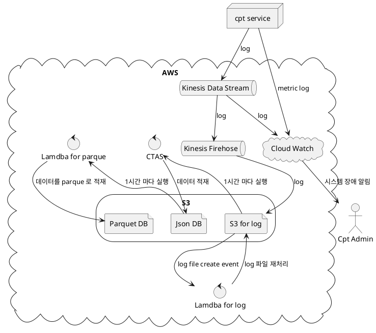

# AWS Kinesis 를 이용한 로깅 시스템

1. 어플리케이션
2. Logback Kinesis layout
3. Kinesis DataStream
   * 분기 to CloudWatch -> end
4. Kinesis Firehose
5. S3
6. Excute Lambda at S3 filecreate event
7. make Json data
8. CTAS 방식으로 매 시간마다 테이블 갱싱
9. select to insert 방식으로 매시간마다 parquet 테이블에 insert 하기

