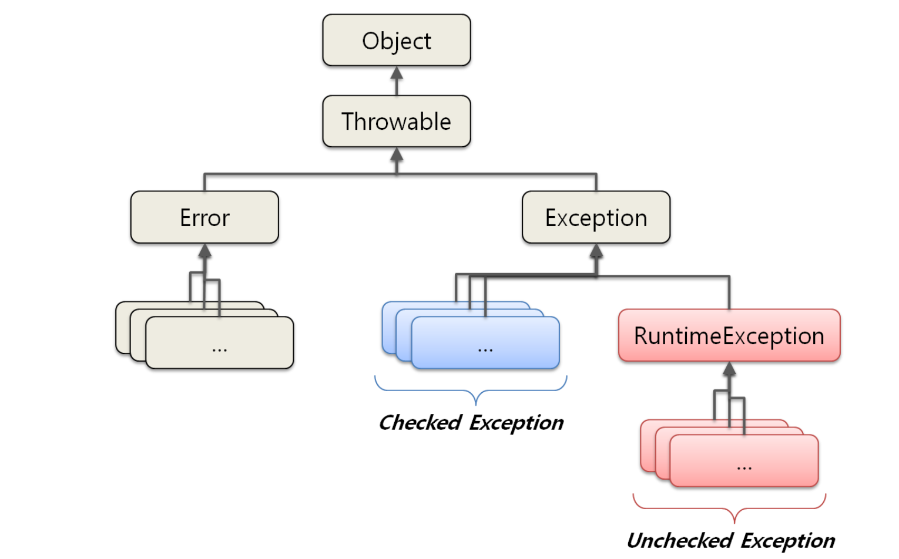

# Exception 

자바에서 에외는 크게 3가지로 나눌수 있다.
* Checked Exception (체크 예외)
* Error (에러)
* Unchecked Exception(언체크 예외)



### Error
에러는 시스템에 비정상적인 상황이 발생했을 경우에 발생합니다. 예를 들어, 메모리 부족(OutofMemotyError) 이나 스택오버플로우(StackOverflowError)와 같이 복수 할 수 없는 것을 말합니다. 
이러한 에러는 개발자가 예측하기도 쉽지 않고 처리할 수 있는 방법도 없습니다. 

### Exception
예외는 프로그램 실행 중에 개발자의 실수나 데이터 처리시 예기치 않은 상황이 발생 했을 때 입니다.
예를 들어 다음과 같은 경우가 있습니다.
* 배열의 범위를 벗어난 경우(ArrayIndexOutOfBoundsException)
* 값이 null이 참조변수를 참조(NullPointerException)
* 존재하지 않는 파일의 이름을 입력(FileNotFoundException)

예외에는 2가지로 나눌 수 있습니다.
* Checked Exception (체크 예외) - Exception 에서 RuntimeException을 상속 받지 않은 예외 (위 그림 참고)
* Unchecked Exception (언체크 예외) - Exception 에서 RuntimeException을 상속 받은 예외 (위 그림 참고)

### Checked Exception(체크 예외)
체크 예외는 RuntimeException의 하위 클래스가 아니면서 Exception 클래스의 하위 클래스들 입니다.   
**체크 예외의 특징은 반드시 에러 처리를 해야 하는 특징(try/catch or throw)을 가지고 있습니다.**   
체크 예외의 예시는 이러한 것들이 있습니다.
* 존재 하지 않는 파일의 이름을 입력(FileNotFoundException)
* 실수로 클래스의 이름을 잘못 적음(ClassNotFoundException)

#### !? 내 생각...  
```text
Checked Exception 명백히 에러가 발생할 수 있는 상황에 미리 정해 놓은 예외로 보인다.
그리고 이 부류의 예외는 사전에 소스 상에서 검토를 하거나 체크를 할수 없는 예외로 보인다.
따라서 반드시 예외 처리를 강제 하는 것으로 보인다.
```


### Unchecked Exception(언체크 예외)

언체크 예외는 RuntimeException의 하위 클래스들을 의미합니다.  
**체크 예외와는 달리 에러 처리를 강제 하지 않습니다.**  
말 그대로 실행 중에(runtime) 발생할 수 있는 예외를 의미 합니다.
언체크 예외는 이러한 것들이 있습니다. 그냥 보아도 실행 중에 발생할 만한 이름들 입니다.
* 배열의 범위를 벗어난(ArrayIndexOutOfBoundsException)
* 값이 null이 참조변수를 참조(NullPointerException)

언체크 예외는 예외 처리를 강제 하지 않는 이유는 무엇일까요?

#### !? 내 생각...
```text
이 부류의 예외는 개발자의 실수 또는 사전에 소스 상에서 확인 해서 막을 수 있는 예외 들로 보인다.
소스 상에서 확인을 하면 해당 에러가 발생 하지 않도록 코드를 짤수 있기 때문에 발생할지 하지 않을지 모르는 에러를 처리 하는 것은 성능 저하 요인으로 보인다. 
그래서 처리를 강제 하지 않는 것으로 보인다. 
예를 들어 소스 상에서 객체에 대해 항상 null 체크를 한다면 NullPointerException은 발생 하지 않는다.
```


### 참조
* [체크 예외와 언체크 예외(Checked, Unchecked Exception)](https://devlog-wjdrbs96.tistory.com/351)
* 